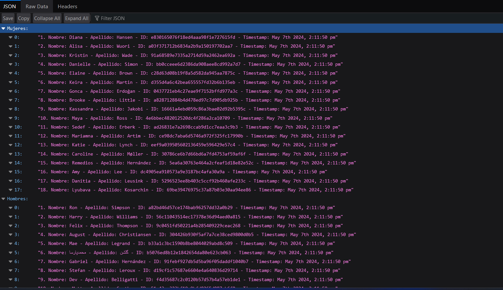
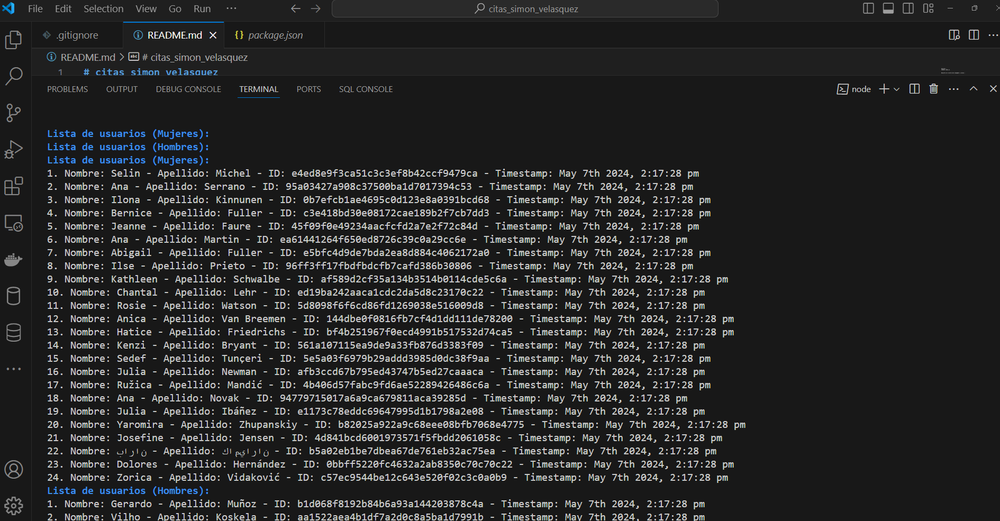

# citas_simon_velasquez
https://github.com/siseveca79/citas_simon_velasquez

Ejecutar : 
npm install express axios uuid moment lodash chalk nodemon

Para poder usar :

import express from 'express';
import axios from 'axios';
import { v4 as uuidv4 } from 'uuid';
import moment from 'moment';
import _ from 'lodash';
import chalk from 'chalk';
import nodemon from 'nodemon';

Ejecutar :
nodemon index.js

Ubicarte en la barra del navegador y coloca :

http://localhost:3000/registrar-usuarios

Y verifica en el navegador y por consola :

http://localhost:3000/consultar-usuarios

Veras en la consola algunos colores y ordenadas.

